<!-- .md means markdown -->

<!-- README.md -->
<!-- This file documents the information about the portfolio project. -->
<!-- It should be READ ME first!!! -->

<!-- Heading level 1 -->
# BELLS-TEST-6
**(SCTP) Full Stack Developer**

Module 8: **Modern Frameworks for Software Development**

***Project Assignment - Portfolio***

<!-- Heading level 3 -->
### Project File Structure:

**BELLS-TEST-6 Directory (Sources Root)**
:README.md

* img directory
: ebookstore-home.png
: ebookstore-products-allproducts.png
: ebookstore-products-popularitems.png
: ebookstore-products-newarrivals.png
: ebookstore-items-viewoptions.png
: ebookstore-register.png
: ebookstore-login.png
: ebookstore-logout.png
: ebookstore-cart-empty.png
: ebookstore-cart-withitems.png
: ebookstore-checkout-stripe.png
: books-C-POST.png
: books-R-GET.png
: books-U-PUT.png
: books-D-DELETE.png

>>> MySQL Framework
* database-mysql directory
: schema.sql
: data.sql
: m8-ebookstore-ER-diagram.png
: m8-ebookstore-LS-diagram.png
: mysql-ebookstore-EER-diagram.png
: database-ebookstore-EER-diagram.mwb

>>> Vite+React Framework
* frontend-react directory
: index.html
: .gitignore
: eslint.config.js
: vite.config.js
: package-lock.json
: package.json
: .env
: .env.sample

> node_modules Folder (node install)

> public Folder (public)
: vite.svg
: bells_icon.ico
: bestsellers.json
: books-popular.json
: books-newarrivals.json
: books.json
: authors.json
: publishers.json
: related.json

> src Folder (source code)
: App.css
: App.jsx
: index.css
: main.jsx
: styles.css
: startbootstrap.css
: HomePage.jsx
: Navbar.jsx
: ProductPopularPage.jsx
: ProductNewArrivalsPage.jsx
: ProductPage.jsx
: ProductCard.jsx
: ItemPage.jsx
: ItemCard.jsx
: RegisterPage.jsx
: UserLogin.jsx
: UserLogout.jsx
: ShoppingCart.jsx
: FlashMessageStore.js
: UserStore.js
: CartStore.js
: ItemStore.js


> assets sub-folder (assets)
: react.svg
: pexels-collection-of-books-photos.jpeg
* bookstore directory
: amazon-thomas-more-utopia.jpg
: amazon-jane-austen-pride-and-prejudice.jpg
: amazon-george-eliot-silas-marner.jpg
: amazon-lincoln-child-1-deep-storm.jpg
: amazon-lincoln-child-4-the-forgotten-room.jpg
: amazon-lincoln-child-6-chrysalis.jpg

> startbootstrap Folder
* startbootstrap-shop-homepage-gh-pages directory
* startbootstrap-shop-item-gh-pages directory

>>> NodeJS/Express Framework
* backend-express directory
: index.js
: database.js
: generateSecret.js
: .env
: .env.sample
: .gitignore
: package-lock.json
: package.json

> node_modules Folder (node install)

> routes Folder
: users.js
: products.js
: cart.js
: checkout.js

> middleware Folder
: UserAuth.js
: HttpUrl.js
: StatusCode.js

> services Folder
: userService.js
: productService.js
: cartService.js
: checkoutService.js
: orderService.js
: stripeService.js

> data Folder
: userData.js
: productData.js
: cartData.js
: orderData.js

<!-- Heading level 1 -->
# Project Guide
For the purpose of the portfolio project, a full-stack eCommerce application is created for the following:

```json
{
1. "Full eCommerce System" : in our case "eBookStore"
}
```

This project is about a simple *eBookStore* at **BELLS** using the concepts we learned in the React Lab, Part1: Creating an Ecommerce Shop Front End and Part 2: Creating the Express API. Instead of online eCommerce System of selling products, we'll be selling physical books online.

POST => C = Create: adding new data to the database   
GET => R = Read: get existing information   
PUT => U = Update: update existing information in the database   
DELETE => D = Delete: remove existing information from the database

Using MySQL to store our database:

- ebookstore : represents the entire company database\
books table: represents the table related to books\
authors table: represents the table related to authors\
publishers table: represents the table related to publishers\
book_publisher table: represents the joined tables between books and publishers

The application of this project caters to the needs of a specific target user group, the retail customers,
who are looking for an online platform to purchase physical books.

The application has a database management system of books information, namely:

***
books (Basic Info)
1. *id*
2. *isbn-10*
3. *isbn-13*
4. *bookTitle*
5. *pageCount*
6. *priceTag*
7. *image*
8. *format*
9. *promotion*
10. *badge*
11. *discount*
12. *review*
13. *author_id*
***

***
authors (Supplementary Info)
1. *id*
2. *firstName*
3. *lastName*
***

***
publishers (Supplementary Info)
1. *id*
2. *publisher*
***

***
book-publisher (Additional Info)
1. *id*
2. *publicationDate*
3. *website*
4. *book_id*
5. *publisher_id*
***

This simple software is a full-stack application for eCommerce System with eBookStore focus on selling physical books online.

It provides RESTful API endpoints for access using HTTP methods (like GET, POST, PUT and DELETE) to obtain the data from MySQL database system.


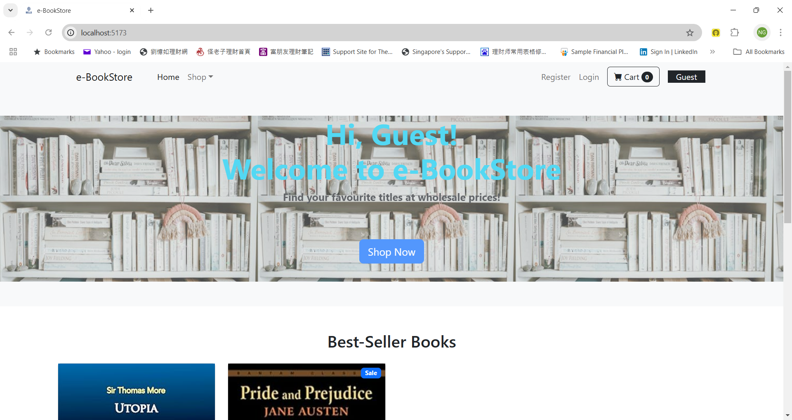

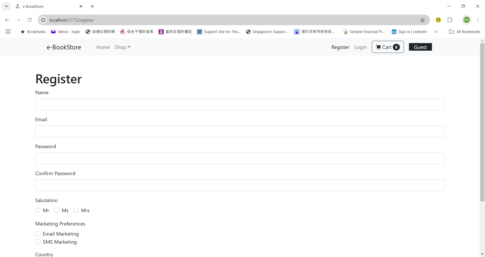


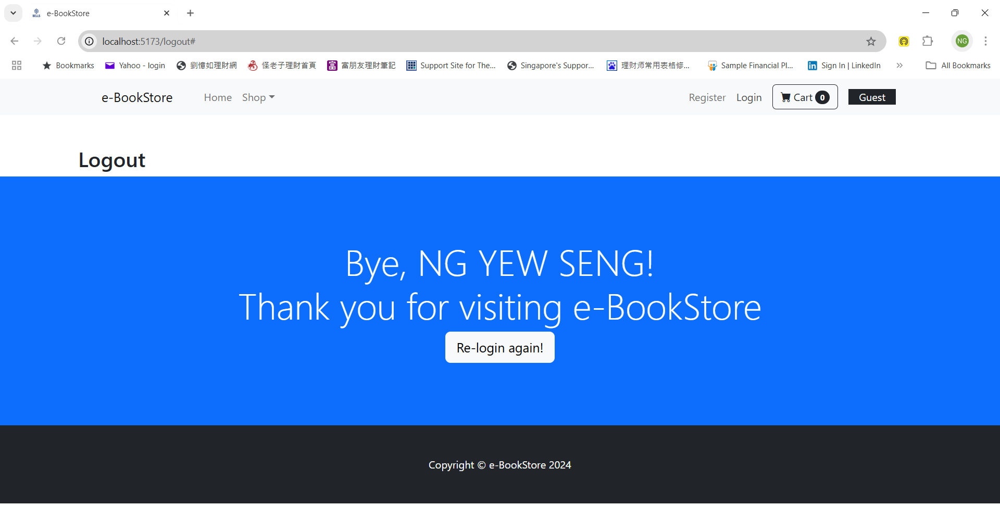

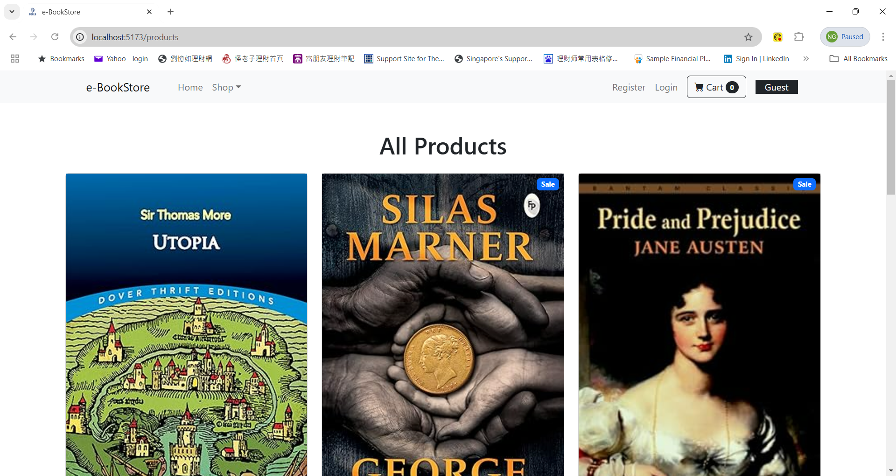

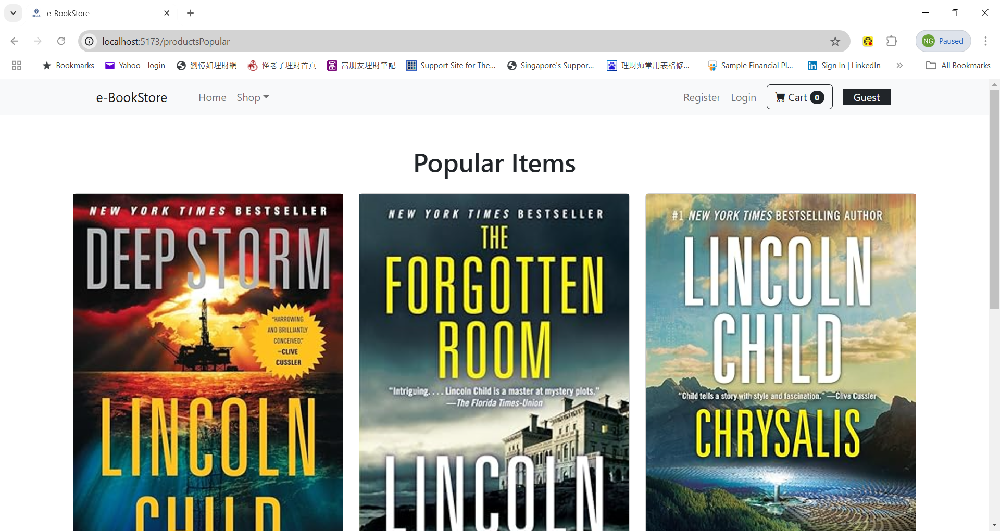

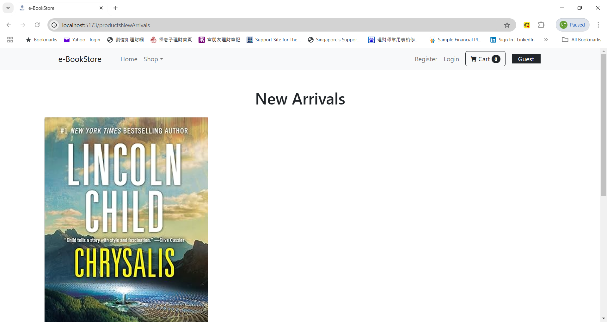

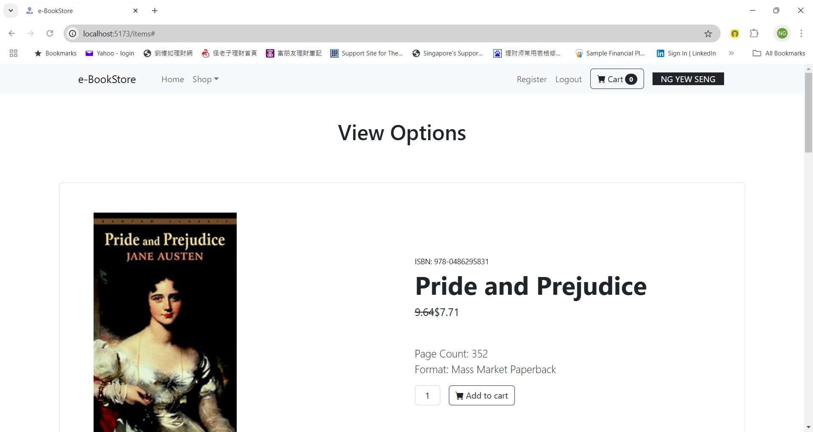

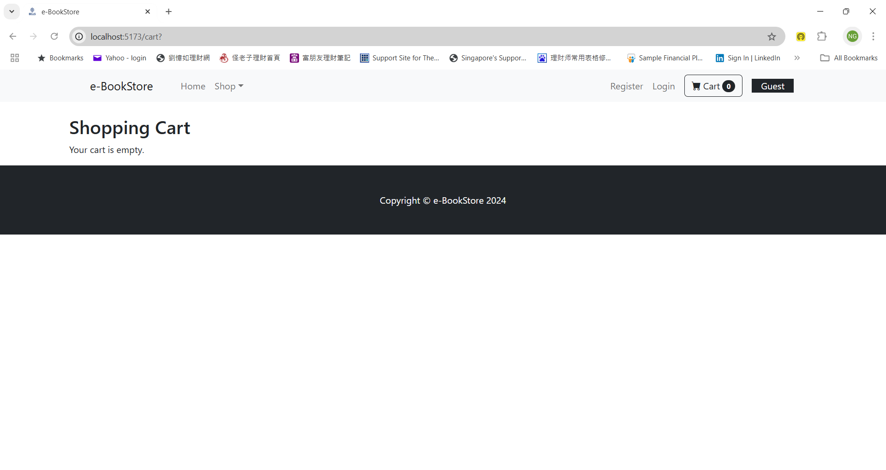

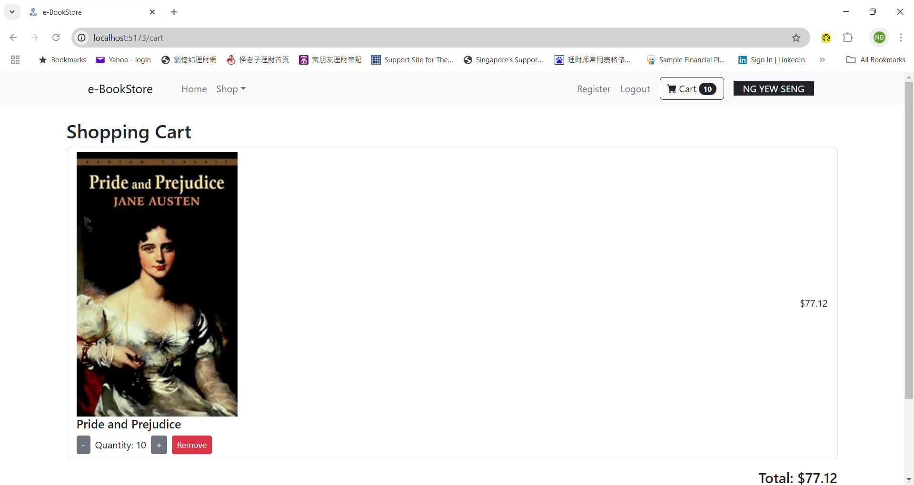

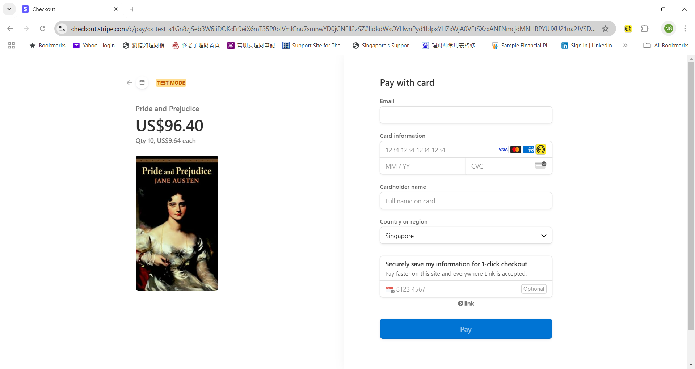

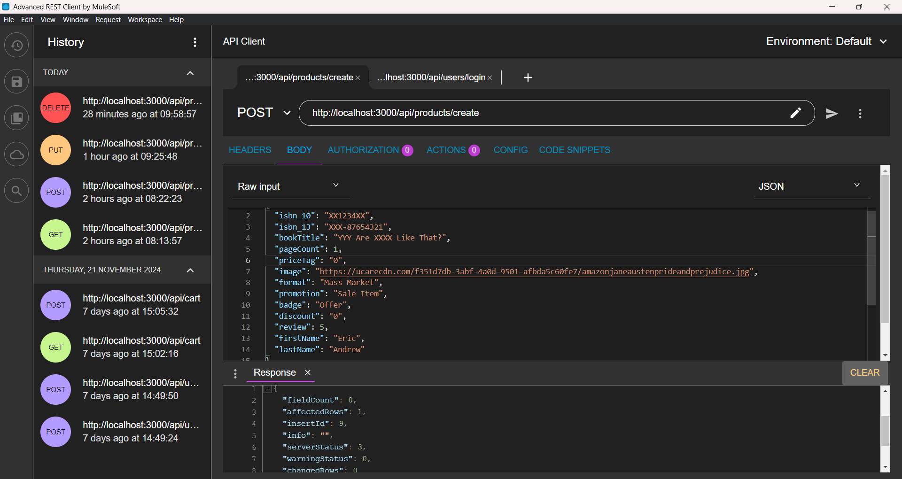

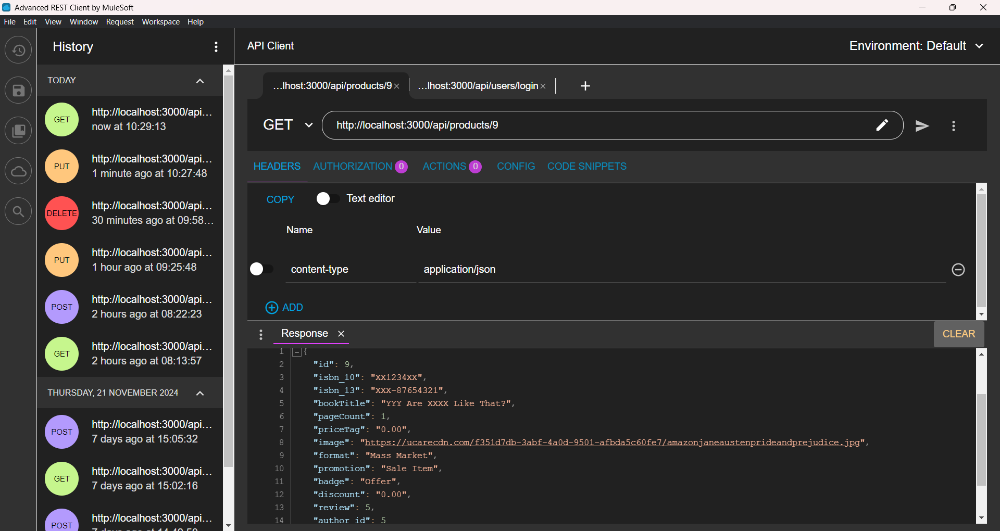

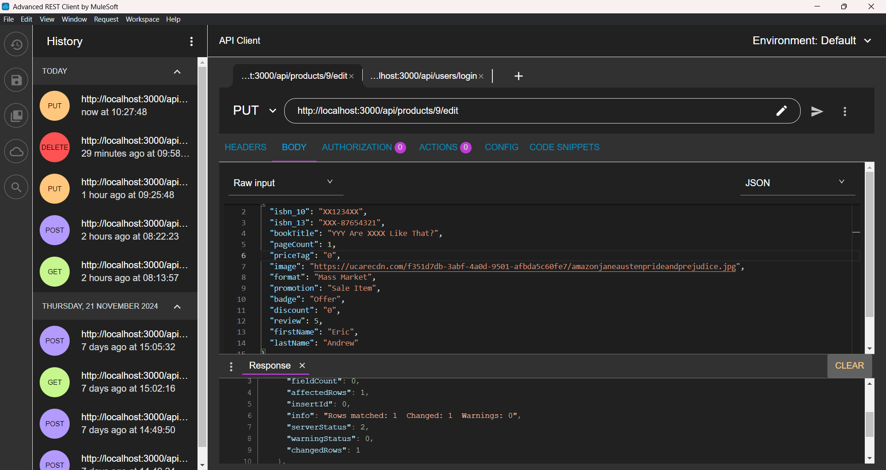

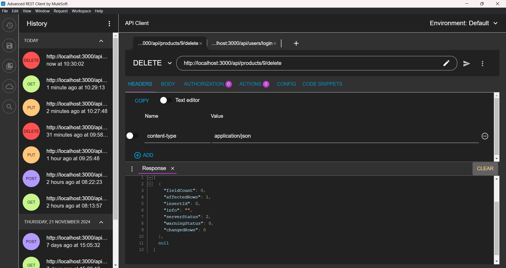

<!-- Heading level 4 -->
#### The url for the portfolio project is here:

It is not deployed.

<!-- Heading level 4 -->
#### The source codes is hosted as public on a Github repository and the link is as follows: 

- [Source Codes Github Link](https://www.github.com/ngys9919/bells-test-6 "My source-codes!")
: Click the hyperlink <https://www.github.com/ngys9919/bells-test-6>

<!-- Heading level 2 -->
## Features

<!-- Heading level 3 -->
### Existing Features
The user interface is provided by React frontend framework. The content is done up with a mix of JSX (JavaScript Syntax Extension) and HTML markup language whilst the style for the website is beautified with CSS stylesheets. The full-stack development cycle should begin with database design, followed by frontend and finally the backend. The backend is developed using layered architecture, that is separation of concern for data access layer (which interacts with database system via SQL commands) and service layer (which contains the business logic). The frontend is developed using reuseable components, state management (like Jotai), immutable (like seamless-immutable), form validation (like Yup) and build forms (like Formik), routing support (like wouter), http and file support (like axios) and lastly local storage.

Index page:
1. Home - to startup landing page with featured products like Best-Seller Books
2. Shop (dropdown menu) - to further select All Products, Popular Items and New Arrivals
3. Register - to register a new user with provided info like Name, Email, Password, Confirm Password, Salutation, Marketing Preferences and Country
4. Login - to login with Email and Password, it is secured via JWT (Json Web Token) which is transparent to the user 
5. Cart - to show Shopping Cart with the items marked for Add to cart with quantity (adjust with + and -) and total price, it also has a checkout button which leads to Stripe interface for card payment


<!-- Heading level 3 -->
### Future Implementation
To deploy into web site using cloud-hosting platform, especially integrating the front-end web application with back-end services and database system which uses environment variables. Future implementation could include making it into progressive web app when using mobile web to have the option of installing as mobile app. More cashless payment options could be explored, besides the Stripe as online payment is not yet fully integrated and tested, it may involve webhooks that provide notifications from Stripe to our web site regarding the online transaction. The online payment implementation approach is a simplified one, the elegant approach where the user interface is our own customised one could be adopted instead of using that of the payment platform.    

<!-- Heading level 2 -->
## Testing
For testing of POST, GET, PUT and DELETE routes, we use the Advanced Rest Client (or ARC for short) as HTTP client. In our case, Visual Studio Code and ARC are used in the testing process.

1. Using CSS Validator   
   The css files are checked with W3C CSS Validation Service for any errors via By file upload method.

   https://jigsaw.w3.org/css-validator/#validate_by_upload

2. Using Test-Cases\
   
<SERVER_URL>=http://localhost:3000

>>2.1 Test the CRUD functions:

>>>2.1.1 Test the create function: To test the create route, we use ARC to send a POST request to <SERVER_URL>/api/products/create. Make sure to provide the following in the body as JSON:

```json
   {
  "isbn_10": "12345678",
  "isbn_13": "978-12345678",
  "bookTitle": "Why Are U So Like That?",
  "pageCount": 22,
  "priceTag": "1.55",
  "image": "https://ucarecdn.com/f351d7db-3abf-4a0d-9501-afbda5c60fe7/amazonjaneaustenprideandprejudice.jpg",
  "format": "Mass Market",
  "promotion": "Sale Item",
  "badge": "Special Offer",
  "discount": "0.12",
  "review": 5,
  "firstName": "Eric",
  "lastName": "Andrew"
   }
```
>>>2.1.2 Test the read function: To test the read route, we use ARC to send a GET request to <SERVER_URL>/api/products/:id.

>>>2.1.3 Test the update function: To test the update route, we use ARC to send a PUT request to <SERVER_URL>/api/products/:id/edit. Make sure to provide the following in the body as JSON:

```json
   {
  "isbn_10": "87654321",
  "isbn_13": "978-87654321",
  "bookTitle": "Why Are U So Like That?",
  "pageCount": 25,
  "priceTag": "1",
  "image": "https://ucarecdn.com/f351d7db-3abf-4a0d-9501-afbda5c60fe7/amazonjaneaustenprideandprejudice.jpg",
  "format": "Mass Market",
  "promotion": "Sale Item",
  "badge": "Special Offer",
  "discount": "0.12",
  "review": 5,
  "firstName": "Eric",
  "lastName": "Andrew"
   }
```
>>>2.1.4 Test the delete function: To test the delete route, we use ARC to send a DELETE request to <SERVER_URL>/api/products/:id/delete.

3. Actual Usage   
   4.1 The url is activated in real use-case for laptop (Acer notebook) via browser (Google Chrome).   
   4.2 In development use-case, the backend is started via node index.js command whilst the frontend is started via npm run dev command, both in local host with each individual Visual Studio Code windows.

<!-- Heading level 2 -->
## Credits

### Acknowledgements
Thanks to Bells for support!

<!-- Heading level 2 -->
## About
> This project work, part of **Module 8: Modern Frameworks for Software Development**, 
> is an individual assessment done by Candidate’s Name (as in NRIC): **Ng Yew Seng** (Candidate’s NRIC: **S XXXX 3 5 3 / F**), 
> a trainee under the **(SCTP) Full Stack Developer** course, organized by **Bells Institute of Higher Learning**. 

>>
>> Coder: ***Ng Yew Seng***\
>> © Copyright 2024\
>> Bells Institute of Higher Learning


<!-- Heading level 2 -->
## Technologies Used
- [x] Vite+React for Front-End
- [x] NodeJS/Express for Back-End
- [x] MySQL for Data-Base


<!-- Heading level 2 -->
## References
1.  [Microsoft Visual Studio Code](https://code.visualstudio.com)

2.  [Microsoft GitHub](https://www.github.com)

3.  [Vite](https://vite.dev/) - Vite is a blazing fast frontend build tool powering the next generation of web applications.

4.  [React](https://react.dev/) - The library for web and native user interfaces

5.  [Node](https://nodejs.org/en) - Run JavaScript Everywhere
   
6.  [Express](https://expressjs.com/) - Fast, unopinionated, minimalist web framework for Node.js

7.  [MySQL](https://www.mysql.com/) - The world's most popular open source SQL database

8.  [Bells Institute of Higher Learning](https://bells.sg)

<!-- hyperlinks -->
[1]: https://github.com "GitHub"